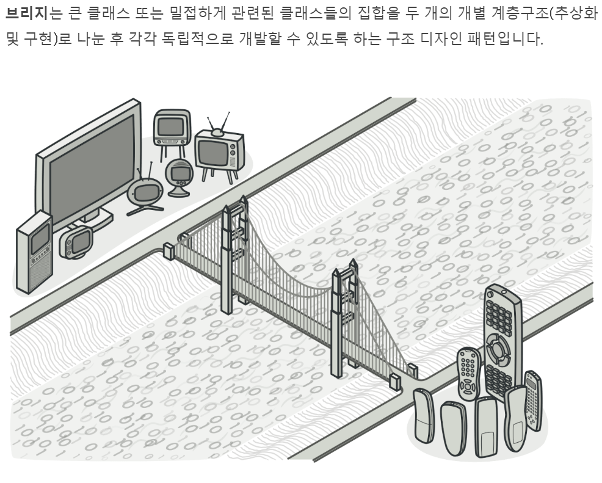
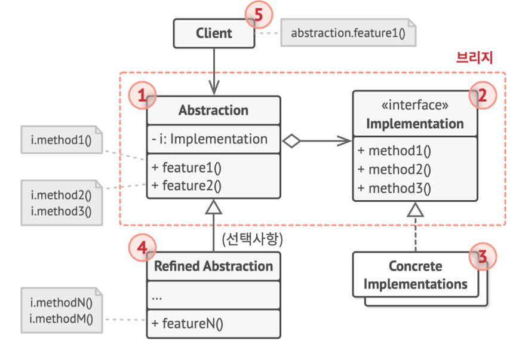

# Bridge 패턴
- 구조 패턴

- Abstraction
  - 상위수준 제어 논리 제공
  - 구현객체에 의존 (DI: Dependency Inversion)
- implementation
  - 모든 구상체에 대한 공통 인터페이스 선언
  - 여기 선언된  메소드 통해서만 구현 객체와 소통
- Concrete Implements
  - 플랫폼 별 맞춤형 코드
- Refinded Abstraction
  - 제어 논리 변형 제공
  - 부모처럼 일반 구현 인터페이스 통해 다른 구현 작업
- 클라이언트
  - 추상화와 작업하는데 관심있음