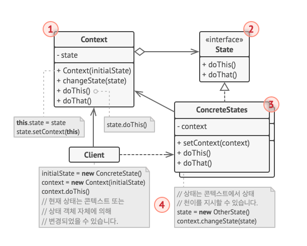
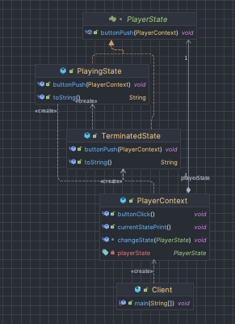

# 상태 패턴

# 개념

- 객체 내부 상태 변경 시 행동을 변경할 수 있는 행동 디자인 패턴
- 객체가 행동 변경할 때 객체가 클래스를 변경한 것처럼 보임
- 상태를 객체화해 상태가 행동하는 것처럼 동작하는 패턴
- 전략 알고리즘은 `전략`, 상태 알고리즘은 `상태`
- 상태 클래스는 싱글톤 클래스.
    - 객체의 현재 상태를 나타는 것이기 때문에 대부분의 상황에서 유일해야함.

# 구조



- Context Class
    - 상태 구현체 하나에 대한 참조 저장
    - 상태별 작업 위임
    - 새로운 상태 객체 전달을 위한 setter
- State interface
    - 상태별 메소드 선언 (모든 상태에서 유효해야 함)
- State Class
    - 상태 별 메소드 구현
    - 공통기능으로 인한 중복코드 방지를 위해 중간 추상 클래스 사용 가능

# 코드



```java
public class Client {
    public static void main(String[] args) {
        PlayerContext player = new PlayerContext();
        player.currentStatePrint();

        player.buttonClick();
        player.currentStatePrint();

        player.buttonClick();
        player.currentStatePrint();
    }
}
```

```java
public class PlayerContext {

    private PlayerState playerState;

    public PlayerContext() {
        this.playerState = new TerminatedState();
    }

    void changeState(PlayerState state) {
        this.playerState = state;
    }

    public void buttonClick() {
        playerState.buttonPush(this);
    }

    public void currentStatePrint() {
        System.out.println(playerState.toString());
        System.out.println();
    }

}
```

```java
interface PlayerState {
    void buttonPush(PlayerContext context);
}
```

```java
public class PlayingState implements PlayerState {
    @Override
    public void buttonPush(PlayerContext context) {
        System.out.println("음악을 정지합니다.");
        context.changeState(new TerminatedState());
    }

    @Override
    public String toString() {
        return "음악 재생 중";
    }
}
```

```java
public class TerminatedState implements PlayerState {
    @Override
    public void buttonPush(PlayerContext context) {
        System.out.println("음악을 재생합니다.");
        context.changeState(new PlayingState());
    }

    @Override
    public String toString() {
        return "음악 정지 중";
    }
}
```

# 적용하면 좋을때

- 객체가 상태에 따라 다르게 행동해야 할 때
- 객체 상태 수가 많을 때
- 상태에 따라 실행되는 코드가 자주 바뀔 때
- 상태에 따라 행동을 바꾸는 조건문으로 전체 코드가 더러워졌을때
- 유사한 상태에 대한 중복 코드, 조건문 기반 상태 전이가 많을 때
- 런타임 시 객체 상태를 유동적으로 변경해야 할 때

# 장단점

## 장점

- SRP. 특정 상태 관련 코드를 별도 클래스로 구성
- OCP. 기존 상태 클래스, 컨텍스트 변경 없이 새로운 상태 도입 가능
- 거대한 상태 분기 조건 제거로 코드 단순화

## 단점

- 적은 수의 상태만 있거나, 상태 변화가 거의 없다면 낭비